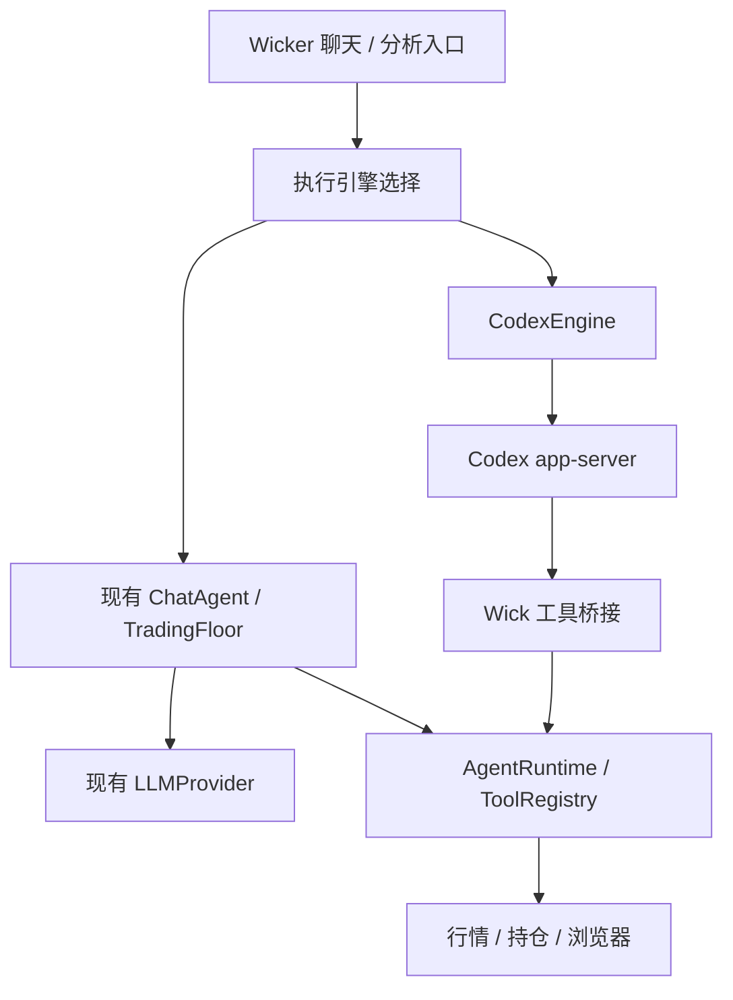

# Wick 的 Codex 驱动方案

日期：2026-09-17。状态：历史调研，**已被用户后续选择取代**。

2026-09-18：用户明确选择复用 `dsh-codex-adapter` 的 OAuth 直连逻辑。
实际实现见 [Codex OAuth](../codex-oauth.md)。以下 app-server 内容保留作方案比较，
不代表当前产品接入方式。

## 目标与建议

在现有 LLM Provider 模式之外增加 Codex 执行引擎。Wick 继续提供聊天界面、行情、持仓、浏览器工具、分析方法和报告历史；Codex 负责会话、推理与原生工具调用。

建议设置分为两个层级：

- 执行引擎：Wick / Codex。
- Wick 引擎下选择现有 Provider、API Key 和模型；Codex 引擎下选择账号、模型与推理强度。

旧会话默认使用 Wick 引擎。不要把完整 Codex 运行时简单塞进 `LLMProvider.complete`，也不要让 `ChatAgent` 再解析 Codex 的文本来执行第二层工具循环。

## 已核对的代码

| 位置 | 现状与接入点 |
| --- | --- |
| `TradingFloor/Sources/TradingFloor/LLM/LLMProvider.swift` | `complete(LLMRequest) -> String`，只抽象文本推理。 |
| `TradingFloor/Sources/TradingFloor/Agents/ChatAgent.swift` | Wick 自己执行工具循环，解析回复中的 `tool_use` JSON 围栏。 |
| `Wick/Views/WickerView.swift` | `dispatchExistingUserTurn` 直接创建 `ChatAgent`；这里需要改为调用引擎接口。文件末尾还有 `WickerLLM` Provider 工厂。 |
| `Wick/Data/AgentRuntime.swift` | 集中注册真实行情、持仓、WebKit 和社交工具，适合由两个引擎共享。 |
| `Wick/Data/ChatStore.swift` | 会话尚无引擎、Codex thread ID 或执行中 turn ID。 |
| `Wick/Data/DeskRunner.swift` | 固定分析流程单独分派 Provider，需要独立接入 Codex 分析入口。 |
| `Wick/Data/SessionTitler.swift`、`LLMDocumentImporter.swift` | 辅助功能也调用 LLM；Codex-only 使用方式不能隐式要求用户另配 API Key。 |
| `WickMCP/Sources/WickMCP/Tools.swift` | 已有 12 个工具，包含行情、持仓、方法论、报告写回、浏览器及社交数据。 |
| `WickMCP/Sources/WickMCP/main.swift` | 美股/国际市场 fallback 仍为 `StubMarketDataProvider`，不能假定与 App 的数据链一致。 |
| `Wick/Resources/Wick.entitlements` | 已开启 App Sandbox；外部进程、凭证位置与登录回调的实际可用性需要单独验证。 |

## 从 dsh-codex-adapter 复用什么

参考目录：`/Users/baixianger/personal/deepseek-harness/dsh-codex-adapter`。

该 adapter 的核心路径是 `PiAiAdapter → pi-ai openaiCodexProvider`。它接入 Codex 模型与账号，但 DSH 仍持有 agent 循环；它并没有运行完整的 Codex app-server。

适合沿用的设计：

1. `lib/auth.js`：认证操作与状态展示分离，只向 UI 返回账号和有效期等元数据。
2. `lib/surface.js`：登录尝试具有独立状态、取消与超时；晚到的旧结果不能覆盖新尝试。
3. `lib/credentials.js`：凭证有明确的权威存储与单一刷新写入者；退出须清理所有会被读取的回退来源。
4. `lib/usage.js`：额度查询和登录状态分离，缓存按账号隔离；网络失败不等于退出登录，缺失额度也不等于零。

对于独立 Codex 引擎，建议保留这些产品行为，由 app-server 管理 OAuth 和刷新。Wick 不必复制 DSH 的 token 文件，也不必重写 pi-ai 的认证代码。

如果后续还需要“保持 Wick 循环，只使用 Codex 订阅模型”的第三条路径，再单独实现 Codex OAuth Provider；这更接近现有 DSH adapter，但与完整 Codex 引擎是两项能力。

## 认证和协议

采用 `codex app-server`，通过 stdio 的 JSONL RPC 通信。官方接口提供账号登录、模型列表、会话、turn、工具与流式事件；dynamic tools 属实验接口，需要明确开启并绑定经过验证的协议版本。[OpenAI Docs](https://learn.chatgpt.com/docs/app-server)

建议顺序：

1. 启动连接，发送 `initialize`，再发送 `initialized` 通知。
2. `account/read` 读取现有登录；不要把本地登录状态当作远端推理成功的证明。
3. 未登录时使用 `account/login/start`，展示返回的浏览器授权入口或设备码；等待完成通知。
4. `model/list` 填充模型选择，避免根据桌面 UI 或硬编码名称猜测当前 CLI 的可用模型。
5. `account/rateLimits/read` 获取额度；失败只影响额度展示。
6. 每个 Wick 会话创建并持久化一个 Codex thread ID，后续恢复该 thread 后发送新 turn。
7. 映射文本、工具、完成、失败和中断事件；取消操作调用 `turn/interrupt`。

认证所有权要明确：

- **使用现有 Codex 登录**：让 Codex 使用已有凭证管理；Wick 的“断开”只关闭连接。不要把它实现为全局 `account/logout`，否则可能影响用户其他 Codex 客户端。
- **Wick 独立登录**：在独立 Codex 数据目录内完成登录，由该运行时持有凭证；退出只影响这个登录环境。不要持续双向同步 refresh token。

首次版本优先验证前者。独立目录能隔离配置和会话，但不应据此假定所有平台的 Keychain 凭证也自动隔离；需要验证当前 Codex 凭证存储行为。[认证说明](https://learn.chatgpt.com/docs/auth)

## 工具、会话和报告

应用内建议桥接现有 `ToolRegistry`：把 `ToolSpec` 转成 dynamic tool schema，收到 `item/tool/call` 后调用注册工具并返回结果。维护显式名称映射，处理现有含点工具名与 Codex schema 约束；未知工具不得执行。浏览器仍在 App 的 MainActor 上运行，cookie 和行情 API Key 留在 Wick 中。

这样可以沿用 App 的真实数据链。WickMCP 则继续服务外部 Codex 客户端；若采用 MCP 作为应用内第一版传输，必须先修复美股 stub 和数据能力不一致的问题。

新增一个小型 `ConversationEngine` 接口，统一表达文本增量、工具开始/结束、完成、失败、用户输入请求及取消。现有 `ChatAgent` 包装为 Wick 实现，`CodexEngine` 为另一实现；工具执行权只交给当前引擎。

会话持久化新增可选字段：引擎、Codex thread ID、模型，以及恢复执行所需的 turn 状态。旧 JSON 缺省为 Wick。用户切换引擎时创建新会话或显式迁移上下文，不能拿已有 Codex thread 又重放整段本地历史。

报告模式可给 Codex 提供相同分析方法和数据，再由 Wick 校验结构化结果并保存为 `Report`。若需要严格的“分析师 → 辩论 → 交易员 → 风控”顺序，由应用明确驱动各阶段；单条提示词运行整份 playbook 不等于现有固定流程具有完全相同的执行保证。

保存报告时使用稳定运行标识防重，记录来源；失败重试不能多次写入。Codex-only 模式的标题可先从首条消息生成，文档优先本地提取文本；需要模型的辅助步骤应明确路由到所选引擎。

## 实施顺序与验收

1. **运行边界验证**：从实际签名的 Wick App 验证启动/连接 Codex、已有登录、回调、退出和重连。终端成功不能替代此步骤。若沙盒下不可行，评估独立伴随进程或单独分发形态，不能仅加一个 `Process()` 就宣称支持 MAS。
2. **聊天闭环**：引擎选择、协议客户端、账号/模型、单会话流式回复、持久化和取消。
3. **真实工具闭环**：桥接行情与持仓，再接浏览器；验证工具 schema、失败结果、权限、取消和重连后的事件去重。
4. **分析与辅助功能**：分析方法、结构化报告、历史写回、标题和附件，确认无 API Key 时也不会落入旧 Provider 分支。
5. **针对性测试**：旧会话解码；RPC 分帧与请求关联；中断后不提交完成结果；凭证错误与额度错误分离；同一报告只保存一次。最后在签名 App 中用真实工具做一次端到端验证。

## 本次验证结果与边界

- 本机 `/opt/homebrew/bin/codex` 为 `codex-cli 0.147.0`。
- 已启动临时 app-server，完成 `initialize` / `initialized`。
- `account/read(refreshToken: false)` 成功识别现有 ChatGPT 登录。
- `model/list` 成功返回模型，当前默认值为 `gpt-5.6-sol`；这只是本机本次结果，不作为产品常量。
- 从该 CLI 导出的实验 schema 确认 `thread/start.dynamicTools`、`turn/start.outputSchema` 以及动态工具响应的 `contentItems` / `success` 字段存在。
- 本次没有创建 Codex 业务会话、发送模型推理请求、导入 token 或修改登录；不能据此声称已验证模型调用、工具循环或额度接口。
- 未发现 `/Applications/Wick.app`；未验证已安装 App 的运行路径。
- 默认 Xcode 工具链报告尚未接受许可，GUI 构建尚未验证。临时指定 Command Line Tools 后可执行 Git 状态检查，不代表 GUI 构建限制已解决。
- 本次仅新增此调研文档，未修改产品代码或用户的 Codex 配置。
