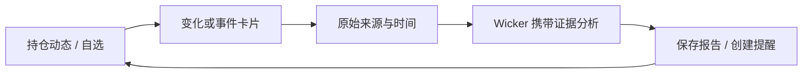
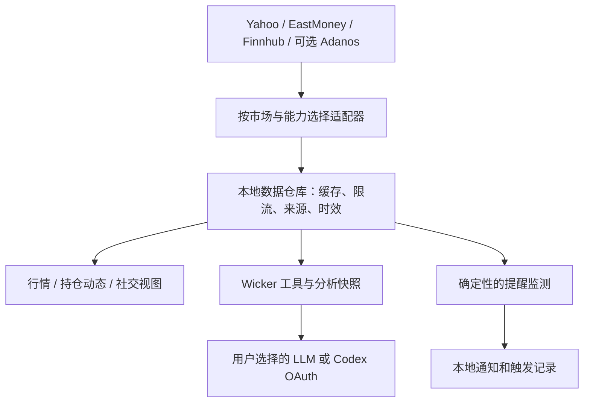

# OpenStock × Wick：数据与产品设计深度研究

日期：2026-09-22。接续 [初步采纳建议](openstock-adoption.md)。

## 结论

建议借鉴 OpenStock 的「发现股票 → 加入自选 → 看相关信息 → 设置提醒」流程，并把它与 Wick 的持仓和 Wicker 分析连接起来。最值得投入的是 **有出处的持仓动态、真实财报日历、多来源情绪对照，以及携带证据进入 AI 的交互**。

结合本轮数据核查，调整首批顺序为：**数据来源与时效 → 持仓动态及财报日历 → 情绪试点 → 提醒和简报**。价格提醒仍有价值，但不能先于可信报价。OpenStock 的页面聚合方式可以立即转化为设计；新增数据源则需要按覆盖和授权逐项启用。

这里的“结合”主要是 Wick 直接使用合适的数据提供方，并独立实现原生界面。当前未发现已核对文档提供面向第三方的稳定 OpenStock 行情 API；其 `API_DOCS.md` 主要说明内部任务和上游集成。[OpenStock 架构文档](https://github.com/Open-Dev-Society/OpenStock/blob/main/API_DOCS.md)

## 研究依据与限制

- 阅读公开 `main` 的数据适配、首页、股票详情、自选、提醒、注册及后台任务源码；未固定到 commit，结论可能随上游更新变化。
- 打开官方演示站，确认登录入口与公开的首页预览；站内工作区需要登录，本次没有创建账户。因此页面信息架构以源码为依据，不能称作完整体验测试。[演示站](https://openstock-ods.vercel.app/)
- 核对 Finnhub 官方文档及浏览器实际渲染的价格表、TradingView 官方 FAQ、Adanos API、价格、条款和白皮书。价格均为调研日公开信息。
- 对照 Wick 当前源码。未调用付费数据接口、未使用用户凭证，也未实测覆盖、延迟、稳定性或情绪预测能力。下文明确区分源码事实、供应商说明和我们的设计建议。

## 1. OpenStock 的数据到底来自哪里

| 数据/能力 | OpenStock 实际路径 | 对 Wick 的意义 |
| --- | --- | --- |
| 股票搜索、公司资料、最新报价 | Finnhub REST，由 Next.js Server Actions 包装 | 可独立写 Swift 客户端；按能力补充 Wick 的现有适配器 |
| 个股和市场新闻 | Finnhub 新闻接口 | 适合结构化文章及自选聚合；按市场路由 |
| K 线、技术摘要、公司财务展示 | TradingView 嵌入组件 | 可参考信息组织；组件显示的数据不能直接成为 Wick 的结构化输入 |
| Reddit/X/新闻/Polymarket 情绪 | 可选 Adanos API | 最有差异化的新增数据候选；需要验证各证券实际覆盖 |
| 自选、提醒、用户偏好 | 自有 MongoDB 记录 | 属于用户状态，Wick 对应本地存储 |
| 邮件摘要、价格检查 | Inngest + 模型/邮件服务 | Wick 可实现应用内简报与本地通知 |

依据：[Finnhub 适配](https://github.com/Open-Dev-Society/OpenStock/blob/main/lib/actions/finnhub.actions.ts)、[股票详情](https://github.com/Open-Dev-Society/OpenStock/blob/main/app/%28root%29/stocks/%5Bsymbol%5D/page.tsx)、[Adanos 适配](https://github.com/Open-Dev-Society/OpenStock/blob/main/lib/actions/adanos.actions.ts)。

### 1.1 Finnhub：优先扩展现有新闻，再补事件和资料

官方文档明确：`company-news` 覆盖北美公司；报价接口以美股为主要场景，持续实时更新推荐 WebSocket。公司新闻与结构化“新闻情绪”是不同接口，后者标为 Premium。财报日历包含公布日期/时段与预期、实际 EPS 和营收，且其 EPS/营收为 non-GAAP 口径。[官方文档](https://finnhub.io/docs/api)

建议的接入矩阵（缓存时间是 Wick 的起始设计参数，需要实测调整）：

| 接口 | 建议用途 | Wick 当前落点 | 初始获取策略 |
| --- | --- | --- | --- |
| `/company-news` | 北美持仓动态、事件证据 | 扩展 `FinnhubClient`；统一返回文章对象 | 按需；5–15 分钟缓存；保留原始发布时间 |
| `/news` | 市场页真实头条 | 新增市场新闻读取 | 按需；支持来源标识和去重 |
| `/calendar/earnings` | 持仓未来事件、财报前准备 | 替换 `MarketView` 中预览日历 | 日级缓存；临近事件允许手动刷新 |
| `/stock/profile2` | 公司名、行业、资料 | 公司资料缓存 | 24 小时起步，独立于报价刷新 |
| `/search`、`/stock/symbol` | 可选补充证券解析 | 现有 Yahoo 搜索与证券映射层 | 搜索防抖；静态证券资料低频更新 |
| `/quote` / WebSocket | 可选的美股报价能力 | 统一报价仓库、后续提醒 | 活跃证券优先；共享连接/限流 |

这些事件/资料扩展属于 **Wick 基于同一上游的新设计**，不代表 OpenStock 已经实现相应工作流。

Wick 已有 `FinnhubClient.headlines`，但它只解码标题和来源并返回 `[String]`；UI 新闻又走另一条 Yahoo/EastMoney 链。扩展时应保留 `id / URL / publishedAt / summary / relatedSymbols / provider`，让页面和 AI 读取同一批文章。新增接口前先消除这两个数据入口的差异。[当前 Finnhub 代码](../../TradingFloor/Sources/TradingFloor/DataAdapters/FinnhubNewsProvider.swift)、[UI 新闻提供方](../../TradingFloor/Sources/TradingFloor/DataAdapters/StockNewsProvider.swift)

Finnhub 公开价格表显示免费方案为 60 次请求/分钟、个人用途；商用或再分发需要核对另行授权，不能把公开订阅价格当作 Wick 的商业授权报价。其条款还涉及衍生结果分享和订阅结束后的数据删除。因此缓存清理、报告导出、向外部模型发送数据，都需要在正式接入范围中核对，而不是认为 BYO Key 自动解决所有使用权问题。[价格](https://finnhub.io/pricing)、[条款](https://finnhub.io/terms-of-service)

### 1.2 Adanos：价值在关注度、来源差异和可追溯性

OpenStock 每次对一个股票并行请求四个来源的 compare 接口，默认七天窗口、五秒超时、五分钟缓存，再输出来源卡片。它已经证明了这类信息可以被组织成紧凑的个股视图；实际数据质量仍需要我们测试。[调用逻辑](https://github.com/Open-Dev-Society/OpenStock/blob/main/lib/actions/adanos.actions.ts)、[卡片](https://github.com/Open-Dev-Society/OpenStock/blob/main/components/stocks/StockSentimentCard.tsx)

Wick 建议先做三项能力：

1. **关注度变化**：在自选中找出近期讨论明显增多的股票，告诉用户哪里值得进一步查看。
2. **来源对照**：同一时间窗展示 Reddit、X、新闻等各自的情绪与样本量，帮助用户发现分歧。
3. **查看依据**：能取得且允许展示时，进入相关文章/帖子；只有聚合指标时明确标为聚合数据，不由 AI 编造代表观点。

产品语义要分开：关注度、看多讨论比例、报价变化、预测市场事件概率是四种不同量。供应商自己的白皮书也强调，Buzz 的研究结果更接近交易活跃度与波动幅度，而非下一日涨跌方向；研究主要使用有 Reddit 覆盖的美股样本，不能据此保证 A/H 股效果。[供应商白皮书](https://adanos.org/buzzscore-whitepaper.pdf)

API 集成要直接以当前文档为准：compare 支持每批最多十个资产；`days` 已是兼容参数，新实现宜使用明确的 UTC `from/to`；鉴权放 `X-API-Key`。无匹配、无内容、权限不足和限流要分别处理。Wick 应保存统计窗口与抓取时间，并按当前计划识别可访问能力。[接口参考](https://api.adanos.org/llms.txt)

有一个需实测的覆盖矛盾：供应商证券参考库列出全球市场，但接口参考中的股票路径格式限制为字母。数字代码、点号、跨市场同名代码如何映射，不能通过直接拼接 Wick symbol 假定成功。参考库有记录、接口接受参数、统计窗口内有内容，也必须分别验证。[证券参考库说明](https://adanos.org/ticker-database/)、[参数说明](https://api.adanos.org/llms.txt)

公开月付方案：Free 为 250 次/月、非商业；Hobby 为 $29/月、250,000 次/月、非商业；Professional 为 $299/月、2,500,000 次/月、允许商业用途并开放 raw mentions。商业集成也不等于获得原始内容任意转售或转发权。适合先做可关闭的可选连接器，具体商业分发模式需按条款确认。[价格](https://adanos.org/pricing)、[条款](https://adanos.org/terms)

### 1.3 TradingView：展示组件和供分析的数据要区分

OpenStock 的丰富图表、财务和技术摘要有很大一部分由嵌入组件提供。TradingView 官方说明这些组件不提供下载/导出底层数据的接口，个人付费订阅也不会改变站点组件的数据权限。[组件数据 FAQ](https://www.tradingview.com/widget-docs/faq/data/)

因此建议保留 Wick 的 CandleKit/IndicatorKit 和已有财务适配器。若某个组件有特别高的展示价值，可评估一个明确标识的可选 Web 页面；它仍然只承担查看功能，AI 证据来自取得授权的结构化提供方。不要把图表组件当作抓取技术指标的接口。

### 1.4 额外发现：可选的离线证券参考库

沿 Adanos 上游发现独立的 [free-ticker-database](https://github.com/adanos-software/free-ticker-database)：提供证券、上市地点、别名和标识符的 CSV，仓库采用 [MIT 许可](https://github.com/adanos-software/free-ticker-database/blob/main/LICENSE)。这不是 OpenStock 本身的数据资产。

可以评估用它改善导入和搜索：本地名称补全、同代码不同交易所消歧、券商代码与 ISIN 映射。优先使用上市记录标识而非只用 ticker，保留来源版本及质量标记，并检查数据来源附带权利。不要把它当作现价来源，也不要把它的证券覆盖数量等同于情绪覆盖。

## 2. OpenStock 的产品设计如何转为 Wick 的体验

OpenStock 自选页把股票表格、相关新闻和提醒侧栏放在同一页。详情页则把价格/图表与公司/情绪信息并排展示。这两个组织方式值得借鉴。[自选页](https://github.com/Open-Dev-Society/OpenStock/blob/main/app/%28root%29/watchlist/page.tsx)、[详情页](https://github.com/Open-Dev-Society/OpenStock/blob/main/app/%28root%29/stocks/%5Bsymbol%5D/page.tsx)

### 2.1 第一屏：为现有 Portfolio 增加“动态”

不必新增一套导航。在现有 Portfolio 的热图、持仓、交易旁增加“动态”，并让 Market 保持全市场视角。

“动态”默认回答三个问题：**我的持仓发生了什么、接下来有什么事件、哪件事值得进一步研究**。

| 区域 | 内容 | 主要操作 |
| --- | --- | --- |
| 范围与状态 | 持仓/自选分组、观察窗口、最后更新、覆盖证券数量 | 换分组、刷新 |
| 值得关注 | 最多三条相关变化；优先确定的事件和新信息 | 查看证据、交给 Wicker |
| 即将发生 | 财报日期、当地市场公布时段、数据是否确认 | 准备财报分析、设提醒 |
| 相关新闻 | 合并重复报道后按持仓关联与新鲜程度排序 | 原文、关联股票、分析 |
| 提醒状态 | 活跃/暂停/已触发、最后检查时间 | 编辑、暂停 |

没有持仓时引导选择自选分组；没有新闻时显示真实空状态。第一版只按“是否持有、事件日期、是否新内容”排序，不在汇率和估值尚不可靠时用持仓权重生成一个精确风险分数。

### 2.2 个股概览：一块紧凑的“近期变化”

Wick 已有 Overview、Chart、News、Social、AI 等标签。建议在 Overview 加一条近期变化摘要，链接到这些已有标签：一条重要新闻、下一次财报、一项情绪变化、当前提醒。用户能快速定位信息，不需要先读一份长报告。

例如“讨论增加，但新闻倾向分化”必须能展开到相同统计窗口的各来源数据。确认不足时写“数据不足”；社交热度上升用中性强调色，不能与股价上涨共用单一绿色语义。维持 Wick 当前原生布局、可访问性和键盘操作，不照搬网页上的大量卡片容器。

### 2.3 Social：从帖子列表升级为来源对照

现有 X、雪球和 StockTwits 内容继续保留。顶部增加来源对照：来源、统计窗口、采样时间、讨论量、看多/看空比例、覆盖状态；下方显示该来源的证据列表。

自报 Bullish/Bearish 标签、模型推断的文章情绪、预测市场交易统计，应显示各自口径。默认不计算跨来源综合“看多概率”。只有窗口和口径可比较时才给出描述性分歧提示；样本太少就显示少量样本，平台之间相互转载的内容也不算多份独立证据。

如果加入 Polymarket，先显示具体事件问题、期限、流动性与更新时间。不能把某个事件的 Yes 价格直接解释成股票上涨概率；方向关系不明确时不参与股票情绪汇总。

### 2.4 Wicker：点击时传递证据，而不是只传股票名

当前浮动输入框会新建会话并关联当前 symbol。新交互应携带结构化上下文：`instrumentID + evidenceIDs + timeWindow + question`，由同一证据仓库提供 UI 展示和工具读取。

建议快捷问题：“哪些事实支持这个变化？”“与上次报告相比什么改变了？”“这些来源为什么出现分歧？”如果只取得了聚合指标，回答应限于聚合观察。外部新闻与帖子作为数据进入工具结果，不可改变工具权限或触发其中夹带的指令。

仍使用用户选定的 LLM/Codex 配置；本地完成缓存、排序和提醒判断。提供方请求只带所需证券标识；只有用户发起相应分析时才按功能需要发送持仓信息给已配置模型，并遵守数据使用权限。

### 2.5 提醒和偏好：短流程、明确状态

参考 OpenStock 表格内的提醒入口，放到 Wick 自选/持仓行和个股页，默认单次阈值提醒。保存前用一句话显示规则、币种和有效期。后续再做财报事件提醒和情绪变更提醒。

OpenStock 注册流程收集国家、投资目标、风险偏好和行业。Wick 可将其中有用的“关注市场、投资周期、关注主题”改为可跳过的本地偏好，影响内容排序和报告详略；无需把首次体验变成开户式问卷。[注册页](https://github.com/Open-Dev-Society/OpenStock/blob/main/app/%28auth%29/sign-up/page.tsx)

## 3. 与 Wick 现有代码的具体结合点

| 当前文件 | 本轮确认的状态 | 建议变化 |
| --- | --- | --- |
| `Wick/Data/AgentRuntime.swift` | 已组合 EastMoney、FMP/Yahoo、Finnhub、FRED 等 | 复用现有路由；增加结构化证据读取，不再到处单独请求 |
| `TradingFloor/.../FinnhubNewsProvider.swift` | 新闻压成字符串 | 扩展为文章对象；兼容旧字符串输出，逐步迁移 |
| `TradingFloor/.../StockNewsProvider.swift` | UI 文章已有链接和发布时间 | 合并为共享的新闻访问入口，增加来源与状态 |
| `Wick/Data/LiveDataStore.swift` | 缓存命中直接返回，可有模拟回退 | 分离可信 QuoteSnapshot 与用于展示的图表数据 |
| `Wick/Data/NewsStore.swift` | 无内容会展示 fixtures，缓存无明确 TTL | 真实空状态、到期刷新；简报和事件禁用 fixtures |
| `Wick/Views/MarketView.swift` | 已有热图/榜单；财报日历是预览，头条使用 fixtures | 先接真实头条和日历；保留已有图表布局 |
| `Wick/Views/PortfolioView.swift` | 当前以热图、持仓和交易为主 | 增加“动态”；跨币种汇总单独完善 |
| `Wick/Views/SocialView.swift` | 已有按市场组织的社交来源 | 增加来源对照、指标与原始内容下钻 |
| `Wick/Views/FloatingWickerComposer.swift` | 将当前证券关联到新会话 | 支持事件/证据上下文 |
| `TradingFloor/.../Tools/SocialSentiment.swift` | 有 `interactiveOnly` 等提供方能力约束 | 新连接器沿用约束，后台任务不能调用仅交互来源 |

另一个与产品设计直接相关的前提：当前 Portfolio 总额直接累加各持仓数值，用第一笔交易的币种显示；缺价时回退成本价。面向跨市场持仓动态，应先按币种分组，或使用带时间戳的 FX 转换，缺价显示不完整估值。否则“对我组合影响最大”的排序会建立在不可靠的总额上。[汇总实现](../../Wick/Views/PortfolioView.swift)

## 4. 数据结构与本地架构建议

新增一个小型共享数据层，以两个使用者为目标：SwiftUI 和 Agent 工具。第一版可以在现有提供方外增加结构化结果及兼容转换，避免一次重写整个分析管线。

拟议的公共对象：

| 对象 | 必需信息 |
| --- | --- |
| `InstrumentID` | 上市地点、证券代码、币种、提供方映射；可选 ISIN/FIGI |
| `QuoteSnapshot` | 报价、报价时间、抓取时间、市场时段、延迟/未知状态；报价币种不能由公司财报币种推断 |
| `NewsArticle` | ID、标题、链接、来源、发布时间、关联证券、取得方式 |
| `SentimentObservation` | 提供方、来源平台、统计窗口、指标口径、样本量、覆盖状态、可用证据引用 |
| `MarketEvent` | 财报等事件、日期精度、时区、预计/已确认状态、来源 |
| `EvidenceBundle` | 本次页面/报告使用的证据 ID、取得时间及版本，供回看和引用 |
| `ProviderCapabilities` | 可覆盖市场、接口权限、交互限制、缓存与导出策略 |

先在字段级区分 live/delayed/stale/unavailable/demo。不要因为整个分析快照是“刚生成”的，就把其中每一项旧数据都视为实时。多个 UI 和 Agent 请求同一资料时共享在途请求和缓存，按账号隔离需要鉴权的数据。

原始内容缓存、聚合值缓存和生成报告应有不同保留策略。支持按提供方清理及追溯报告来源，不默认建立永久的第三方内容数据库。

## 5. 请求量与运行成本

以下是容量估算，不是实测；不含重试、搜索及手动刷新。

OpenStock 自选表格代码实际每五秒刷新一次，虽然旁边注释写十五秒。20 个证券，仅报价就约 `20 × 60 / 5 = 240` 次/分钟，超过 Finnhub 免费计划的 60 次/分钟。Wick 应按可见证券、市场开闭市和订阅额度调度，资料缓存与价格更新分开。[表格轮询](https://github.com/Open-Dev-Society/OpenStock/blob/main/components/watchlist/WatchlistTable.tsx)、[Finnhub 价格](https://finnhub.io/pricing)

Adanos 按最多十个证券一批估算，20 个证券、四个来源、每天四轮、每月22天：

| 调用方式 | 请求/月 |
| --- | ---: |
| 每个证券独立请求四来源 | 7,040 |
| 每批十个证券、四来源 | 704 |
| 同样20个证券，仅每天一轮、30天 | 240 |

所以免费计划只能用于有限试验，第三种情况几乎没有其他调用余量。推荐首版只在主动打开或刷新相关视图时请求，按同一窗口批量查询，页面切换复用结果。升级前先测覆盖与用户实际使用频率；价格和数据授权是两个独立判断。

## 6. OpenStock 的实现中哪些不能照搬

- 行情适配把缺失价格当作零、缺失币种当 USD，P/E 有零占位；Wick 应保留 missing 状态。[数据映射](https://github.com/Open-Dev-Society/OpenStock/blob/main/lib/actions/finnhub.actions.ts)
- 提醒弹窗有名称输入，但提交参数没有名称；价格变化会重设阈值，可能覆盖正在编辑的值；界面文字使用严格大于/小于，检测逻辑包含等号。独立设计时需让输入、保存与判断语义一致。[弹窗](https://github.com/Open-Dev-Society/OpenStock/blob/main/components/watchlist/CreateAlertModal.tsx)、[判断](https://github.com/Open-Dev-Society/OpenStock/blob/main/lib/inngest/functions.ts)
- 触发后的通知未完成；周报是一般新闻广播。不能把这两个功能描述为已验证的个性化通知闭环。[后台任务](https://github.com/Open-Dev-Society/OpenStock/blob/main/lib/inngest/functions.ts)
- 情绪汇总使用简单均值和固定阈值。可以借鉴来源对照的呈现，不能把这些阈值当作经过金融验证的交易信号。[汇总逻辑](https://github.com/Open-Dev-Society/OpenStock/blob/main/lib/actions/adanos.helpers.ts)
- 本地提醒在应用关闭或 Mac 休眠时无法持续运行，醒来后的单次报价不能还原期间是否跨过阈值；首版界面必须显示最后检查时间。

## 7. 分阶段交付与验证

| 阶段 | 可交付结果 | 验收标准 |
| --- | --- | --- |
| A：统一真实数据 | 结构化新闻、来源/时间状态、真实日历 | 页面和 AI 引用同一文章；没有样例进入分析；同证券请求去重 |
| B：持仓动态 | Portfolio 动态页、个股近期变化、证据进入 Wicker | 三次以内操作从变化定位到原文或分析；无持仓/无数据/过期状态明确 |
| C：情绪试点 | 可选 Adanos 连接器及来源对照 | 实测覆盖矩阵；同窗口比较；失败不伪装为中性；显示配额和更新时间 |
| D：跟踪闭环 | 可信报价上的提醒、应用内简报 | 不用模型判断阈值；重启不重复触发；通知失败可回看；简报有出处 |

情绪试验建议用公开测试证券，包含美股常见股、冷门股、ETF、点号股类代码、港股、A 股、欧洲同名上市证券和无效代码。对每一来源记录：代码解析、是否授权、是否有内容、最近数据时间、响应时间、证据可用性。合约和 API 计划未确认前，不承诺跨市场覆盖。

首批工程测试重点：报价过期、新闻无时间、UTC 窗口与交易所时区、不同币种、API 401/403/429、部分来源失败、同一文章多源重复、取消后的晚到响应，以及提供方断开后的缓存处理。数据连接成功率和证据可追溯率优先于增加指标数量。

## 8. 许可与最终选择

OpenStock 的 [AGPL-3.0](https://github.com/Open-Dev-Society/OpenStock/blob/main/LICENSE) 与 Wick 当前 [专有许可声明](../../README.md) 需要分别考虑；本建议以独立实现功能和信息架构为前提。代码许可、供应商 API 使用权、第三方文章/帖子展示权也不是同一件事。

**推荐方案：保留 Wick 的本地架构与原生图表；先把已接入的数据变成有出处的持仓动态，再以可选连接器验证 Adanos。** Finnhub 优先用于北美新闻和财报事件，A/H 股沿用现有区域提供方；证券参考库作为独立的代码识别增强候选。所有新增名称和界面均为设计建议，本次没有改动运行时代码或开通任何订阅。
